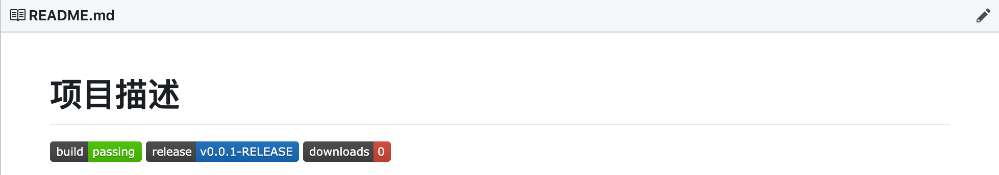
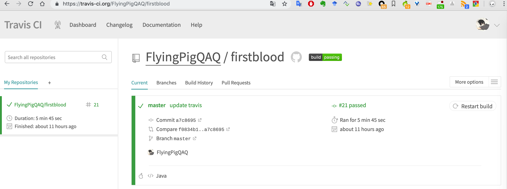

## [Travis](https://travis-ci.org/)
travis自动给github repository增加了hook钩子,可以为仓库的每次更新进行编译或者自动发布。  
**目前免费提供给github公共仓库,如果仓库是私有的是不提供免费服务的**。

### travis-cli安装
travis-cli提供服务了对github person token的加密，防止发布到github repository时候，token泄露，所以使用该组件
是很有必要的
#### 安装步骤
1. 检查ruby是否安装成功
```shell
$ ruby -v
ruby 2.0.0p195 (2013-05-14 revision 40734) [x86_64-darwin12.3.0]
```  
2. 安装travis
```shell
gem install travis -v 1.8.10 --no-rdoc --no-ri
```  
3. 再次确认travis-cli安装成功
```shell
$ travis version
1.8.10
```  

#### Travis Deploy Github Releases
> travis每次都会读取根路径下的.travis.yml配置文件  

1. 使用travis-cli工具生成.travis.yml  
`travis setup releases`  
会依次输入github的用户名和密码用来做token加密，还有file用来表示要上传到github releases
2. 配置文件模板以及参数介绍  

```yml
language: java
os: osx
# safelist
branches:
  only:
    - master

#清空缓存  默认
before_cache:
  - rm -f  $HOME/.gradle/caches/modules-2/modules-2.lock
  - rm -fr $HOME/.gradle/caches/*/plugin-resolution/
# 清空缓存 默认
cache:
  directories:
    - "$HOME/.gradle/caches/"
    - "$HOME/.gradle/wrapper/"

before_deploy:
  # Set up git user name and tag this commit
  - export TRAVIS_TAG=`cat build.gradle |grep -e '^version'|cut -d " " -f2|cut -d "'" -f2`
  - git tag $TRAVIS_TAG
  - ls ${TRAVIS_BUILD_DIR}/build
  - ls ${TRAVIS_BUILD_DIR}/build/distributions
deploy:
  provider: releases
  # 覆盖文件
  overwrite: true
  api_key:
    secure: ndWxLslRBYhp4DukjyAcuxvk/asgf+DbBCUktxJ45GD1+ydpb0HatLzMUhvLyB2Vs0Z34Slm6KgXyDC5ecOqfIM/SSbr0Olc....此处省略
  #启用通配符，来支持 file参数 通配‘*’等表达式
  file_glob: true
  # 一定要加这个，否则travis会删除在build阶段生成的所有文件
  skip_cleanup: true
  # 要上传的github release 的文件
  file: ${TRAVIS_BUILD_DIR}/build/distributions/*
  on:
    # github 用户名/仓库名
    repo: FlyingPigQAQ/firstblood
    # true:只有在打标签的时候才会触发deploy
    tags: false
```  
#### 小技巧
？如何为github README 添加`building pass`徽章  
##### 示意图

##### 打开travis对应github仓库构建地址
地址为：https://travis-ci.org/GITHUB_USERNAME/REPOSITORY_NAME

右键页面中的building|pass的图标，选择**复制图片地址**，然后再README.md中添加如下显示语句即可
```shell

```
那么以后每次构建，都会将最终的构建结果，通过该小图标实时的表示出来。
#### 参考文档
- [Travis官网](https://travis-ci.org/)
- [Travis docs](https://docs.travis-ci.com/)
- [Travis deploy java docs](https://docs.travis-ci.com/user/deployment/releases/)
- [Travis-cli docs](https://github.com/travis-ci/travis.rb)
