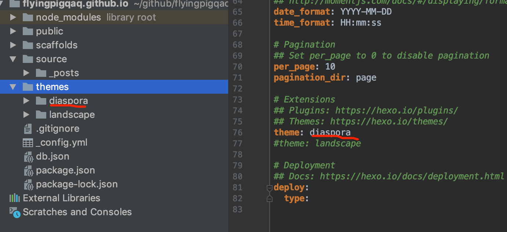

## 1. Hexo安装和启动
```shell
#安装hexo组件
npm install hexo-cli -g
#初始化一个项目,名称为blog
hexo init blog
cd blog
#安装依赖
npm install
#启动hexo
hexo server
```
## 2. Hexo更新主题
#### 2.1 步骤：
1. 进入到themes目录
2. `git clone git@github.com:Fechin/hexo-theme-diaspora.git` 下载主题
3. 更改最外层的_config.yml的`theme: diaspora`(保证该名称和themes中的主题目录名称一致)

#### 2.2 更改主题遇到的坑
从git clone 克隆下的文件夹如果和最外层_config.yml里的theme主题文件不符的话，会造成no layout,需要修改一致。如下如所示。
```
cd flyingpigqaq.github.io
cd themes
git clone git@github.com:Fechin/hexo-theme-diaspora.git
vi ../_config.yml->theme:diaspora
重命名hexo-theme-diaspora目录名为diaspora
```
  
## 3. Hexo常用命令
#### 3.1 常用命令介绍
- `hexo init [folder]` 初始化网站，默认在当前文件夹建立网站
- `hexo new [layout] < title>` 新建一篇文章。如果没有设置 layout 的话，默认使用 _config.yml 中的 default_layout 参数代替。如果标题包含空格的话，请使用引号括起来。
- `hexo clean` 清除缓存,删除public目录。
- `hexo generate`  简写为hexo g;生成静态网页(存储于public目录)。
  - `-d,--deploy` 文件生成后立即部署网站
  - `-w,--watch` 监视文件变动
- `hexo deploy`    简写为hexo d;发布静态网站到github。
- `hexo server` 启动服务器，默认访问地址：`http://localhost:4000/`。

#### 3.2 Hexo配置发布到github
 _config.yml配置
```yml
# Deployment
## Docs: https://hexo.io/docs/deployment.html
deploy:
  type: git
  #博客仓库地址
  repo: https://github.com/FlyingPigQAQ/flyingpigqaq.github.io.git
  #Github Pages使用的仓库分支名称
  branch: master
```
>注意配置文件中repo参数不能使用Git协议，需使用Https协议。
## 4. Hexo官网使用
- [Hexo中文官网地址](https://hexo.io/zh-cn/)
- [Hexo英文官网地址](https://hexo.io/)  

>中英文官网之间存在文档差异(因翻译进度不一致)。
